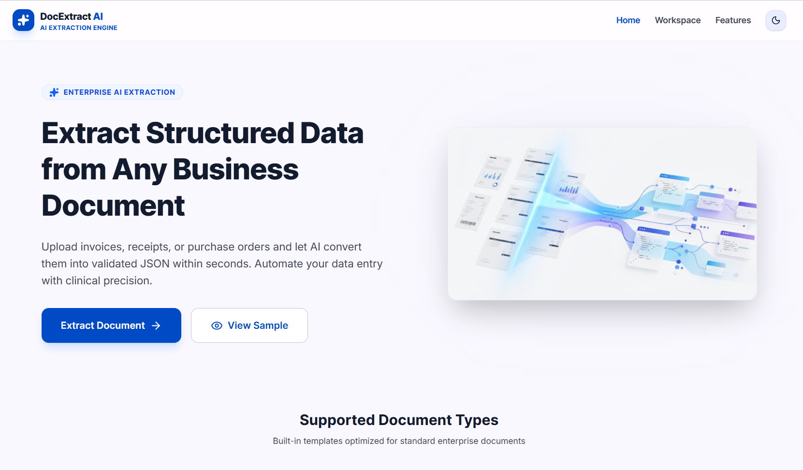

# 📄 DocExtract AI — Document Data Extraction Engine

---



<div align="center">
  <a href="https://doc-extract-ai.netlify.app/" target="_blank" style="text-decoration: none;">
    
  </a>
</div>

DocExtract AI is a full-stack web application designed to convert unstructured business documents—such as invoices, receipts, and purchase orders—into validated, structured JSON payloads. The system couples client-side parsing (digital PDF text extraction and optical character recognition) with cognitive language models to automate data extraction.

---

## 📑 Table of Contents

- [Features](#features)
- [Installation](#installation)
- [Architecture](#architecture)
- [API](#api)
- [Sample Results](./SAMPLE_RESULTS.md)
- [License](#license)

---

## ✨ Features

- **🌐 Cross-Document Intelligence**: Purpose-built parsers and validation templates for:
  - **Invoices**: Extracts line items, tax details, billing terms, date chronology, and vendor records.
  - **Receipts**: Tailored for business travel, retail, and expense management logs.
  - **Purchase Orders**: Maps ordering hierarchies, delivery deadlines, unit totals, and custom terms.
- **🔄 Intelligent Multi-Provider AI Fallback Engine**:
  - Automatically routes document payloads through a resilient cognitive tier.
  - **Primary**: Google Gemini (`gemini`)
  - **Secondary / Fallback**: OpenRouter (`openrouter`) (Default: `google/gemini-2.5-flash`)
  - **Emergency Fallback**: Groq Engine (`groq`) (Default: `llama-3.2-11b-vision-preview`)
  - Logs execution traces, failover logs, error statuses, and exact API latencies directly into an interactive Diagnostics Terminal.
- **💾 Export & Portability Suite**:
  - **Download JSON**: Instantly export the fully parsed schema in clean formatted JSON for ERP ingestion.
  - **Export CSV**: Standardize metadata headers and detailed table rows into a structured CSV file for accounting and ledger management.
- **📁 Multi-Format Upload Hub**: Supports native drag-and-drop or manual selection for PDFs, PNGs, JPGs, JPEGs, and WEBP formats up to 10MB.
- **⚡ Hybrid Visual OCR & Parsing Pipeline**:
  - Automatically identifies whether documents contain selectable digital text layers or require localized visual OCR.
  - Returns complete confidence score arrays for crucial metadata boundaries.
- **📐 Interactive Structured Workbench**:
  - **Real-Time Overlay Canvas**: Highlights OCR bounding zones interactively as you hover over structured form inputs.
  - **Interactive Spreadsheet Editor**: Edit, append, or delete line-item entities with immediate recalculations.
  - **Synchronized JSON Terminal**: Copy, inspect, and export clean JSON schemas instantly.
- **🛡️ Clinical Validation Engine**:
  - **Date Validation**: Ensures logical flow (e.g., Issue Date $\le$ Due Date).
  - **Arithmetic Integrity Check**: Performs math assertion loops ($Subtotal + Tax = Total$) and cross-references table records.
  - **Currency Uniformity**: Validates currency types across all itemization blocks.
  - **Duplicate Prevention**: Intelligently flags duplicate line entries.
- **🌓 Adaptive Global Theme Engine**:
  - **Context-Powered Toggle**: Global theme state manager powered by a lightweight **React Context Provider** (`ThemeContext`).
  - **Dynamic Theme Synchronization**: Seamlessly toggles the root interface between high-contrast light and dark UI states.
  - **Smart Persistence**: Detects and defaults automatically to the user's OS system preferences, with manual selections securely persisted inside `localStorage`.
  - **Fluid Tokens**: Utilizes custom Tailwind design tokens to guarantee color consistency across all views and interactive widgets under both modes.
- **🔔 Interactive Toast Notification System**:
  - **Action Acknowledgements**: Displays non-blocking floating notifications when downloading JSON configurations, exporting CSV ledgers, copying payloads, or updating ledger items.
  - **Custom Animation Curves**: Utilizes smooth micro-motion and responsive cubic-bezier scales/slides to slide toast bubbles gracefully on screen.
  - **Multi-Type States**: Supports adaptive `success`, `info`, and `error` styles designed to blend with Light and Dark aesthetics.
- **✨ Premium View Entrance Transitions**:
  - **Dynamic Entrance**: Applies a slide-and-scale entrance animation to active workspaces and dashboard panels during system mounting.
  - **Visual Continuity**: Smoothes out screen-routing transitions using custom physics curves (`[0.16, 1, 0.3, 1]`) to match native desktop interfaces.

---

## 🛠️ Tech Stack & Languages

- **Frontend Environment**:
  - ⚛️ **React 18** (Functional hooks architecture)
  - ⚡ **Vite** (Next-generation lightning-fast frontend tooling)
  - 🎨 **Tailwind CSS** (Utility-first styling with customized fluid design tokens)
  - 🌀 **motion/react** (Fluid micro-interactions and route-change layouts)
  - 🛠️ **Lucide React** (Consistent, modern vector iconography)
- **Backend Environment**:
  - 🟢 **Node.js** & **Express**
  - 🦾 **TypeScript** (Strict type definitions spanning client & server layers)
- **Cognitive Engines**:
  - 🧠 **Multi-Model Fallback System** (Gemini, OpenRouter, Groq API interfaces)
  - 👁️ **Tesseract.js / pdf.js** (Digital text extraction and visual OCR)

---

## 📂 File Structure

```text
docextract-ai/
├── .env.example              # Environment variables template
├── .gitignore                # Production untracked files setup
├── index.html                # Entry points for Vite SPA mounting
├── package.json              # Scripts, modules, and dependencies manifests
├── server.ts                 # Full-stack server (Express, API routers, Vite middleware)
├── tsconfig.json             # TypeScript compiler rules
├── vite.config.ts            # Client-side bundler configuration
├── netlify.toml              # Netlify cloud configuration
│
├── server/                   # Backend services & orchestrators
│   └── services/
│       └── ai/
│           ├── ProviderInterface.ts  # Interface standard for AI Services
│           ├── GeminiService.ts     # Google Gemini API provider integration
│           ├── OpenRouterService.ts # OpenRouter proxy service integration
│           ├── GroqService.ts       # Groq high-speed vision model integration
│           ├── FallbackManager.ts   # Failover scheduling & trace-logging engine
│           ├── PromptBuilder.ts     # Standardized schema extraction instructions
│           └── ResponseValidator.ts # Dynamic validation, sanitization, & parsing
│
└── src/                      # Client React codebase
    ├── App.tsx               # Primary screen router, states, and app entry
    ├── index.css             # Tailwinds setup, base styles, and animations
    ├── main.tsx              # React mounting file
    ├── types.ts              # Global TypeScript models and structures
    │
    ├── context/              # Global state contexts
    │   ├── ThemeContext.tsx  # Dynamic Light/Dark Theme management context
    │   └── ToastContext.tsx  # Premium Toast notification service context
    │
    └── components/           # Modular visual views and cards
        ├── HomeView.tsx      # High-fidelity dashboard, landing and features page
        ├── UploadView.tsx    # File drag-and-drop and templates selector
        ├── AnalyzingView.tsx # Real-time progress visualizer and pipeline status logs
        ├── ResultsView.tsx   # Visual workbench, mock-document, fallback engine tabs, and spreadsheet
        └── AnalyticsView.tsx # Dynamic arithmetic audits, confidence score gauges, and alerts
```

---

## 🚀 Installation & Local Setup

### 📋 Prerequisites
Ensure you have the following installed on your machine:
- [Node.js](https://nodejs.org/) (v18 or higher recommended)
- [npm](https://www.npmjs.com/) (Node package manager)

### ⚙️ Step-by-Step Setup

1. **Clone the Project**:
   ```bash
   git clone https://github.com/bikram73/Document_Extract_AI
   cd Document_Extract_AI
   ```

2. **Install Dependencies**:
   ```bash
   npm install
   ```

3. **Configure Environment Variables**:
   Create a `.env` file in the root directory by copying the example template:
   ```bash
   cp .env.example .env
   ```
   Open the newly created `.env` file and input your secure API Credentials:
   ```env
   GEMINI_API_KEY=your_gemini_api_key_here
   
   # Optional Fallbacks
   OPENROUTER_API_KEY=your_openrouter_key
   OPENROUTER_MODEL=google/gemini-2.5-flash
   GROQ_API_KEY=your_groq_key
   GROQ_MODEL=llama-3.2-11b-vision-preview
   AI_PROVIDER_PRIORITY=gemini,openrouter,groq
   ```

4. **Launch the Development Server**:
   ```bash
   npm run dev
   ```
   The local server will boot. Open your browser and navigate to:
   👉 **`http://localhost:3000`**

5. **Build for Production**:
   Compiles client-side bundles and compiles server TypeScript into an optimized, standalone CommonJS module inside `dist/`:
   ```bash
   npm run build
   ```

6. **Start Production Service**:
   ```bash
   npm run start
   ```

---

## 🏗️ Architecture Pipeline

Below is a visual diagram of the document processing and extraction pipeline:

```text
+------------------------------------------------------------+
|                        User Upload                         |
|         Supports PDF, PNG, JPG, JPEG, WEBP (< 10MB)        |
+------------------------------+-----------------------------+
                               |
                               v
+------------------------------------------------------------+
|                  Client-Side Pre-processing                |
|  - Digital PDF: Extracts raw text layers via pdf.js        |
|  - Images/Scans: Extracts localized text via Tesseract.js  |
+------------------------------+-----------------------------+
                               |
                               v
+------------------------------------------------------------+
|            Node.js / Express Backend Proxy                 |
|            - Endpoints exposed at /api/extract             |
|            - Handles environment-safe API credentials      |
+------------------------------+-----------------------------+
                               |
                               v
+------------------------------------------------------------+
|              Intelligent AI Provider Fallback              |
|        Attempts connection in priority sequence:            |
|        1. Gemini Service (Primary)                         |
|        2. OpenRouter Service (Secondary)                   |
|        3. Groq Vision Service (Tertiary / Emergency)       |
+------------------------------+-----------------------------+
                               |
                               v
+------------------------------------------------------------+
|               Post-Extraction Validation Layer             |
| - Strips formatting/markdown wrappers                      |
| - Verifies schema compliance (vendor, financials, totals)  |
| - Normalizes numerical records & line-item schemas         |
+------------------------------+-----------------------------+
                               |
                               v
+------------------------------------------------------------+
|                  Interactive UI Workbench                  |
| - Real-time editable spreadsheet with custom recalculations|
| - Integrity checks panel & copyable JSON output terminal   |
+------------------------------------------------------------+
```

---

## 🧠 AI Prompt Strategy & Anti-Hallucination Guardrails

To ensure high-fidelity extraction and mitigate hallucination tendencies of large language models, the prompting framework is engineered as follows:

1. **Strict Output Constraints (No Preambles)**: The model is instructed to output a raw JSON payload directly. By explicitly stating: `"Return ONLY a valid JSON object. Do not include any markdown formatting, backticks, or wrapper blocks"`, we prevent parsing failures on the backend and bypass conversational preambles.
2. **Explicit Null Coercion**: Instead of allowing the model to make logical guesses about missing metadata fields (such as `vendorTaxId` or `dueDate`), the prompt instructions state: `"If a field is not present in the document, set its value to null. Do not invent, extrapolate, or estimate values."`
3. **Closed-Loop Arithmetic Auditing**: Rather than blindly transcribing numerical strings, the prompt instructs the model to double-check calculation logic (e.g., confirming whether `subtotal + tax = total`) and reflect the mathematical validity in an `integrityCheck` block.
4. **Post-Extraction Sanitizer**: The backend implements a robust verification utility (`ResponseValidator.ts`) that runs immediately after the LLM output is received. It catches partial/broken JSON, enforces correct numeric conversions, handles array fallbacks for missing line items, and establishes sensible defaults to prevent interface exceptions.

---

## 📊 Confidence Scores Explanation

Each document extraction evaluates and assigns a set of distinct confidence ratings:

- **Overall Confidence**: An aggregate assessment of the document's structure, completeness, and legibility as assessed by the language model contextually.
- **Vendor Confidence**: Determined by analyzing the clarity and prominence of the vendor name, registered tax ID, and branding fields.
- **Date Confidence**: Generated by analyzing standard ISO representations, matching syntax markers, and checking logical chronology.
- **Line Items Confidence**: Evaluates the consistency of tables, itemizations, description boundaries, and math calculations across individual entries.
- **Currency Confidence**: Evaluates the consistency of currency identifiers throughout the document.

---

## 📄 Challenge Deliverables

The core requirements outlined in the challenge guidelines are mapped to the following modules:

1. **Sample Documents Included**: Pre-configured sample files for **Invoices**, **Receipts**, and **Purchase Orders** are integrated directly into the Upload Hub. Reviewers can test the extraction features immediately with one click.
2. **Structured JSON Output**: A copyable, syntax-highlighted JSON code block is updated in real-time in the output terminal of the Workbench as edits are made.
3. **Validation Notes & Audits**: The interactive workspace highlights integrity warnings regarding:
   - **Chronology**: Verifying that the due date occurs on or after the issue date.
   - **Arithmetic**: Ensuring line items sum precisely to the subtotal, and subtotal + tax sums precisely to the total.
   - **Currency Uniformity**: Flagging mismatched currency codes within the same document context.
4. **Transparent Codebase**: Schema properties are isolated cleanly within TypeScript type definitions to ensure complete compliance.

---

## 🖨️ Sample JSON Payload

Below is an example of the validated extraction output schema generated by the system:

```json
{
  "documentType": "Invoice",
  "vendorName": "Stripe Payments UK",
  "vendorTaxId": "GB 123 456 789",
  "invoiceNumber": "INV-2024-88412",
  "issueDate": "Oct 24, 2024",
  "dueDate": "Nov 23, 2024",
  "currency": "USD ($)",
  "paymentTerms": "Net 30",
  "financials": {
    "subtotal": 1995.00,
    "tax": 399.00,
    "total": 2394.00
  },
  "lineItems": [
    {
      "description": "AI Document Processing (Enterprise)",
      "qty": 1,
      "unitPrice": 1200.00,
      "amount": 1200.00
    },
    {
      "description": "Custom API Integration Support",
      "qty": 5,
      "unitPrice": 150.00,
      "amount": 750.00
    },
    {
      "description": "Monthly Cloud Storage Surcharge",
      "qty": 1,
      "unitPrice": 45.00,
      "amount": 45.00
    }
  ],
  "confidence": {
    "overall": 95,
    "vendor": 99,
    "date": 97,
    "lineItems": 84,
    "currency": 100
  },
  "insights": "This document appears to be a Service Invoice from Stripe Payments UK dated October 24, 2024. The billing cycle matches your previous subscriptions.",
  "integrityCheck": {
    "dateValidation": "PASSED",
    "arithmeticTotal": "PASSED",
    "currencyConsistency": "PASSED"
  },
  "alerts": [
    {
      "title": "Address Mismatch",
      "message": "The vendor address on invoice differs from the Master Data record. Recommended: Update CRM record."
    }
  ]
}
```

---

## 🌐 API Documentation

The Express server exposes the following API endpoints to handle document operations securely:

### 1. Document Extraction
- **Endpoint**: `POST /api/extract`
- **Content-Type**: `application/json`
- **Request Body**:
  ```json
  {
    "base64Data": "data:image/png;base64,iVBORw0KG...",
    "mimeType": "image/png",
    "fileName": "invoice_october.png"
  }
  ```
- **Success Response (200 OK)**:
  ```json
  {
    "success": true,
    "data": { ... }, // ExtractedData structured JSON schema
    "providerUsed": "gemini",
    "providerReason": "Primary Provider",
    "providerLogs": [
      {
        "provider": "gemini",
        "event": "STARTED",
        "message": "Attempting document extraction using GEMINI...",
        "timestamp": "2026-07-08T05:31:15.000Z"
      },
      {
        "provider": "gemini",
        "event": "SUCCESS",
        "message": "Successfully extracted structured data in 1435ms.",
        "timestamp": "2026-07-08T05:31:16.435Z",
        "latencyMs": 1435
      }
    ]
  }
  ```
- **Error Response (500 Internal Server Error)**:
  ```json
  {
    "success": false,
    "error": "Intelligent AI Provider Fallback Engine failed. All active providers failed to extract data."
  }
  ```

### 2. Health Check
- **Endpoint**: `GET /api/health`
- **Success Response (200 OK)**:
  ```json
  {
    "status": "ok",
    "timestamp": "2026-07-08T05:31:15.000Z"
  }
  ```

---

# 📄 Sample Documents & Extraction Results

To help reviewers quickly evaluate the AI Document Data Extractor, a complete set of sample documents and their corresponding structured JSON outputs are included in this repository.

### Included Samples

- 📄 Invoice → PDF + Extracted JSON
- 🧾 Receipt → Image + Extracted JSON
- 🧾 Receipt 2 → Image + Extracted JSON
- 📦 Purchase Order → Image + Extracted JSON

👉 **View all sample documents and outputs here:**

➡️ [Sample Documents & Extraction Results](./SAMPLE_RESULTS.md) ⬅️

This page includes:

- Original input documents
- Generated JSON outputs
- Validation summary
- OCR and AI extraction results
- Confidence scores
- AI provider information

---

## ⚡ Performance Notes

- **Processing Latency**: Standard processing cycles average between **1.5 to 4 seconds** depending on document length and network round-trip speeds.
- **Payload Max Limits**: API routes enforce a maximum request limit of **50MB** to support high-resolution scans, while client-side validations warn of files exceeding **10MB** to optimize client performance.
- **OCR Processing Time**: Tesseract.js client OCR processes document text in **1 to 2 seconds** locally before transporting data to the server, ensuring quick frontend feedback.

---

## ⚠️ Known Limitations

1. **Extremely Low Resolution / Blurry Images**: Hand-captured documents with high radial blur, glare, or extremely low lighting might degrade OCR accuracy, resulting in lower confidence scores.
2. **Complex Multi-Page Tables**: Documents with tables spanning across multiple pages without consistent header records can occasionally experience row-alignment drift.
3. **Handwritten Fields**: While the cognitive model is capable of reading legible cursive handwriting, highly stylized or messy handwriting can occasionally result in transcription gaps.
4. **Foreign Language Currencies**: Standard processing maps USD, EUR, GBP, and major currency formats accurately. Highly exotic or regional currency symbols might fallback to default representation string formats.

---

## 📄 License

This project is licensed under the [MIT License](LICENSE).
