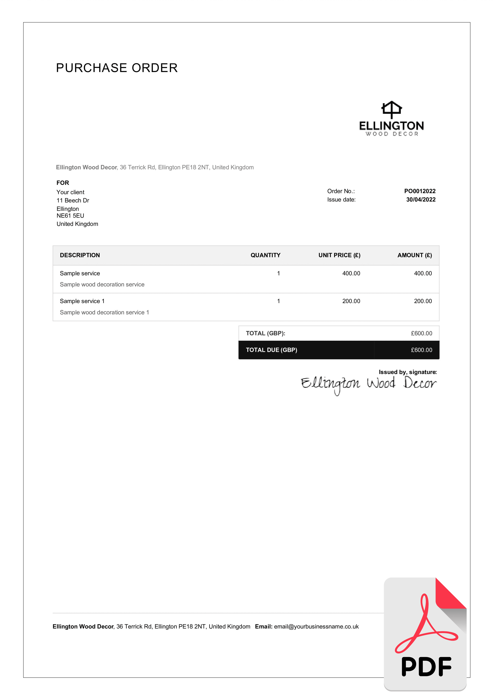
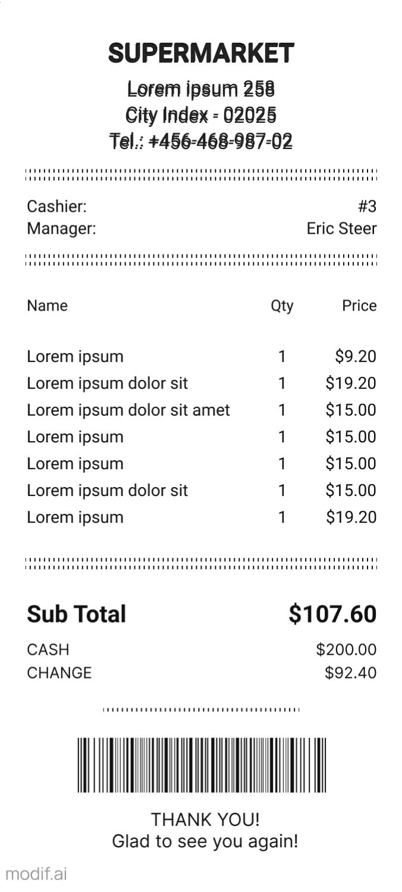

# 📄 Sample Documents & Extraction Results

This document contains sample inputs and their corresponding AI-generated structured JSON outputs for the **AI Document Data Extractor**.

---

# 📁 Directory Structure

```text
sample-documents/
├── Invoice.pdf
├── receipt.jpg
└── Purchase_order.png

sample-output/
├── invoice.json
├── receipt.json
└── purchase_order.json
```

---

# 📑 Sample 1 — Invoice

## Input Document

📄 **File:** `sample-documents/Invoice.pdf`

> Click below to download/view the sample invoice.

[📄 View Invoice](sample-documents/Invoice.pdf)

---

## Extracted JSON

📄 **File:** `sample-output/invoice.json`

```json
{
  "... invoice json here ..."
}
```

---

# 📦 Sample 2 — Purchase Order

## Input Document

### Purchase Order Preview

> If you have exported this PDF as an image, place it inside:

```text
assets/Purchase_order.png
```

Then display it like this:



---

## Extracted JSON

📄 **File:** `sample-output/purchase_order.json`

```json
{
  "... purchase order json here ..."
}
```

---

# 🧾 Sample 3 — Receipt

## Input Document

Since this is already a JPG image, GitHub will display it directly.



---

## Extracted JSON

📄 **File:** `sample-output/receipt.json`

```json
{
  "... receipt json here ..."
}
```

---

# ✅ Validation Summary

| Document | OCR | AI Extraction | Arithmetic Check | Date Validation | Status |
|----------|:---:|:-------------:|:----------------:|:---------------:|:------:|
| Invoice | ✅ | ✅ | ✅ | ✅ | Passed |
| Purchase Order | ✅ | ✅ | ✅ | ✅ | Passed |
| Receipt | ✅ | ✅ | ✅ | ✅ | Passed  |

---

# 🤖 AI Provider Used

| Document | OCR Engine | AI Provider | Fallback Used |
|----------|------------|------------|---------------|
| Invoice | Tesseract OCR | Gemini 2.5 Flash | No |
| Purchase Order | Tesseract OCR | Gemini 2.5 Flash | No |
| Receipt | Tesseract OCR | Gemini 2.5 Flash | No |

---

# 📊 Overall Results

- ✅ Successfully processed **3 document types**
- ✅ Extracted structured JSON
- ✅ Performed arithmetic validation
- ✅ Validated dates where available
- ✅ Detected missing fields
- ✅ Generated AI insights
- ✅ Produced confidence scores
- ✅ Ready for downstream automation

---
